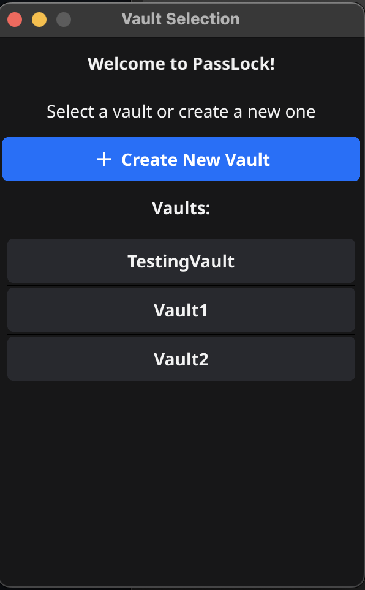
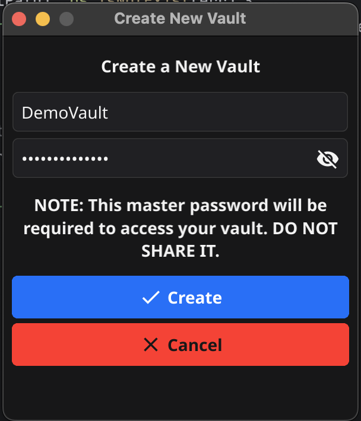

<h1 align="center">PassLock 🔐</h1>
<h6 align="center">A simple, secure, and cross-platform password manager in Go.</h6>

<h2 align="center">In Very Early Development 🏗️</h2>

## Technology Overview 🤖
- **Language** - Go
- **Encryption** - AES-GCM 256
- **Hashing/KDF** - Argon2id
- **Storage** - SQLite database files
- **Interface** - fyne.io UI framework *(W.I.P)*

## Encryption and Security ⚙️
### Methods - Encryption and Hashing 🔑
PassLock ***currently*** utilizes one primary hashing function, as well as one primary encryption function.
Go, being widely used for backend web development, has extensive hashing and encryption tools.
Additional functions may be available to users in the future.

**Hashing** - Argon2id
- Why Argon2?
  - The Argon2 hashing function has proved to be very effective and secure for storing passwords. For example, Argon2 won the Password Hacking Competition in 2015.
  - Argon2 offers many customizable parameters to enhance security, such as multiple iterations, memory usage, and the number of threads used.
    
**Encryption** - AES-GCM 256
- Why AES-GCM 256?
  - AES-GCM implements a strong integrity ensurance function within the encryption. If an attacker alters the ciphertext, the decryption will fail.
  - AES-GCM does not require padding. This prevents padding oracle attacks, an attack common in AES-CBC.
  - Every encryption requires a 12-byte nonce, which allows for a different ciphertext to be generated from the same key depending on the nonce.

### In Practice - Key Derivation, Hashing, and Authentication 🛡️
As previously discussed, PassLock utilizes **Argon2id** key derivation.

**Key Splitting** 🪓
- Given a master key in plaintext by the user (e.g. "password123"), PassLock uses Argon2id to derive a 64-byte key.
- This 64-byte key is split into **two** 32-byte keys.
  - One key is used for encryption/decryption, and the other key is used to verify that the user is authorized to access the password vault.

The hashed authentication key will be stored in the SQLite password vault and compared with a hashed user-provided password to authorize the user to access the vault.

### User Workflow (UI is a W.I.P) 👤
PassLock utilizes the fyne.io UI framework. This framework will allow users to select, edit, and create SQLite password vaults.
- Once authenticated into a vault, users will be able to see a table-style list of services and usernames.
- The encrypted passwords and notes for password entries will be encrypted and hidden.
- The user will be able to reveal these encrypted passwords and notes for individual entries.
- These encrypted passwords and notes will be decrypted at the time of which the button is pressed.
  - ***(W.I.P)*** The memory address of the decrypted information will be filled with randomly generated information to ensure the decrypted passwords are not available in plaintext within memory for too long.

**Export/Import (Planned)**
PassLock will allow users to import and export password vault files. 
- While it is not entirely recommended, this would allow users to upload vaults to Cloud services such as Google Drive to backup passwords.
- Password vaults would be exported using a separate file extension *(.plockdb)* and encrypted.
  - This would mean that the individual passwords within the vault are encrypted, as well as the vault itself.
  - As such, a different key than the master key should be used to encrypt the file.
- Users will be able to import this encrypted vault and provide a password to decrypt the vault.
  - This password will follow a very similar process as seen in the individual password encryption/decryption and hashing processes.
  - The file will be decrypted and stored in the internal PassLock system storage, renamed to a *.sqlite* file extension as opposed to the double-encrypted *.plockdb* extension.

### Early User Interface Images 💻

